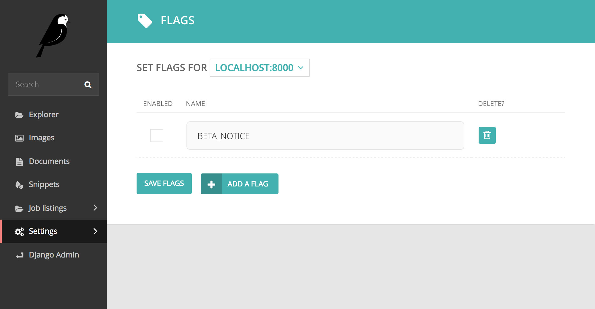

# Feature flags

Feature flags are stored in the Wagtail database and exposed in the Wagtail admin under “Settings”:


Here flags can added, enabled, or disabled:




The flag consists of a single string (by convention all uppercase, with underscores instead of whitespace). Flags are disabled by default, and checks for flags that do not exist will return False.

Once a flag has been created it can be checked in Python and Jinja2 templates using the functions flag_enabled and flag_disabled found in flags.template_functions and exposed to templates in v1. 

## Python example

```python
from flags.template_functions import flag_enabled, flag_disabled

If flag_enabled('BETA_NOTICE'):
	print(“Beta notice banner will be displayed”)

If flag_disabled(‘BETA_NOTICE’):
	print(“Beta notice banner will not be displayed”)
```
	
## Jinja2 template example:

```

    <div class="m-global-banner">
I’m a beta banner.   
    </div>

```

Feature flags are implemented as a Django app in cfgov-refresh/cfgov/flags. 

## Feature Flag Hygiene

Feature flags should be rare and ephemeral. Changes should be small and frequent, and not big-bang releases, and flags that are no longer used should be cleaned up and removed from code and the database.
